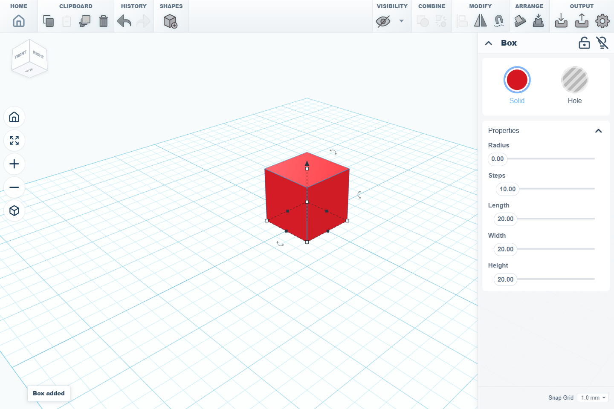

# SketchForge

SketchForge is a local-first browser 3D editor for building, grouping, cutting, importing STL files, and exporting models from the same workspace you see on screen.

It is built around a simple idea: open the app, place shapes, turn some shapes into holes, group the result, import external STL models when primitives are not enough, and export the finished design without needing an account.

<p align="center">
  
</p>



## Contents

- [What SketchForge Is](#what-sketchforge-is)
- [Highlights](#highlights)
- [Feature Tour](#feature-tour)
- [Media And Demo Videos](#media-and-demo-videos)
- [Quick Start](#quick-start)
- [Project Structure](#project-structure)
- [Local Data](#local-data)
- [Current Status](#current-status)
- [Tech Stack](#tech-stack)
- [Development Scripts](#development-scripts)
- [Contributing](#contributing)
- [Security](#security)
- [License](#license)

## What SketchForge Is

SketchForge is an experimental CAD-style editor made for fast 3D scene building in the browser. It focuses on the core workflows that make a lightweight modeling tool useful:

- add primitive shapes to a workplane
- move, scale, rotate, lift, mirror, align, copy, paste, and delete objects
- mark objects as holes
- group solids and holes into a new result
- import STL files and use them alongside built-in shapes
- export the whole workspace or only the selected objects as STL/OBJ
- keep projects local in the browser with generated thumbnails

The project is still alpha, but the main editor loop is already usable: create a project, build a shape, import STL, group, export, come back later.

## Highlights

- **Local-first projects**  
  Designs are stored in browser storage. No account or backend database is required for ordinary use.

- **Real editor workspace**  
  The workplane includes camera controls, snap grid settings, transform handles, shape inspector controls, and selected-object outlines.

- **Primitive shape library**  
  Add boxes, cylinders, spheres, cones, pyramids, wedges, text, round roofs, half spheres, torus shapes, tubes, and holes.

- **Hole and grouping workflow**  
  Turn shapes into holes, combine them with solids, and create cut geometry that exports as it appears.

- **STL import**  
  Bring in external STL files and mix them with SketchForge primitives.

- **STL and OBJ export**  
  Export selected objects when something is selected, or export the entire workspace when nothing is selected.

- **Project dashboard**  
  Projects appear as cards with generated thumbnails. New edits can update the preview image, and projects can be deleted with confirmation.

- **Browser-based stack**  
  Built with Next.js, React, TypeScript, Three.js, and Manifold/CSG geometry tooling.

## Feature Tour

### Editor Workplane

The editor centers the design around a grid workplane. Shapes can be added from the toolbar, selected in the viewport, and adjusted with visible transform handles.

Current editor controls include:

- add shape
- copy, paste, duplicate, and delete
- undo and redo
- hide/show controls
- group and ungroup
- align and mirror
- workplane/drop controls
- import and export
- workspace settings
- snap grid selector
- camera home, fit, zoom, and camera mode buttons

### Shape Inspector

Selecting a shape opens a side inspector for object-specific controls. For a box, the inspector exposes:

- solid/hole mode
- radius
- steps
- length
- width
- height

Other shapes expose the controls that match their geometry.

### Primitive Shapes

SketchForge includes a starter shape set for building quickly:

- Box
- Cylinder
- Sphere
- Cone
- Pyramid
- Wedge
- Text
- Round Roof
- Half Sphere
- Torus
- Tube

Each shape can be moved, resized, lifted, rotated, copied, mirrored, aligned, hidden, grouped, or exported.

### Holes And Boolean Grouping

Shapes can be switched from solid mode to hole mode. When grouped with solids, holes are used as cutters so the final model matches the visible grouped result.

This workflow is important for:

- making slots
- cutting mounting holes
- carving through imported STL parts
- testing enclosure-style designs
- combining simple primitives into useful printable shapes

### STL Import

STL import lets SketchForge work with existing 3D models instead of only built-in primitives.

Useful examples:

- import a board model and cut holes through it
- place imported parts next to primitive supports
- combine an STL with simple boxes/cylinders for rough enclosure planning
- export the final scene after editing

### Export

SketchForge supports STL and OBJ export.

Export behavior:

- if objects are selected, only the selected objects are exported
- if nothing is selected, the whole workspace is exported
- grouped/hole results export as the geometry shown in the editor

### Dashboard

The dashboard is the project home screen. It supports:

- creating a new 3D design
- importing STL directly into a new project
- continuing the latest workplane
- searching projects
- grid/list project views
- project thumbnails
- project delete confirmation
- download/export location settings

## Media And Demo Videos

The README already includes the first hero photo: a block placed in the editor.

The next step is to record short feature videos. Keep them short, direct, and without long pauses. Ten to thirty seconds each is enough.

Put finished clips in:

```text
docs/media/videos/
```

Recommended filenames:

```text
docs/media/videos/01-create-and-edit-block.mp4
docs/media/videos/02-import-stl.mp4
docs/media/videos/03-hole-grouping.mp4
docs/media/videos/04-rotated-hole-cut.mp4
docs/media/videos/05-export-selected-vs-all.mp4
docs/media/videos/06-dashboard-thumbnails.mp4
```

### Video 1: Create And Edit A Block

Show the basic first-run workflow:

1. Open SketchForge.
2. Create a new project.
3. Add a Box.
4. Resize it.
5. Lift it.
6. Rotate it.
7. Return to the dashboard and show the project thumbnail.

This should be the main beginner demo.

### Video 2: Import STL

Show that SketchForge can work with real imported models:

1. Start from the dashboard.
2. Click Import STL.
3. Choose an STL file.
4. Show it placed in the editor.
5. Move or scale it.
6. Add a primitive shape next to it.

Use the Raspberry Pi-style STL demo if that is still your clearest example.

### Video 3: Hole Grouping

Show the signature boolean workflow:

1. Add a solid Box.
2. Add a second Box or Cylinder.
3. Switch the second shape to Hole.
4. Move the hole through the solid.
5. Select both.
6. Press Group.
7. Show the cut result.

This is one of the most important videos.

### Video 4: Rotated Hole Cut

Show the advanced grouping case:

1. Add a solid.
2. Add a hole.
3. Rotate the hole.
4. Group the shapes.
5. Orbit the camera around the result.

This proves rotated cutters are part of the workflow, not just axis-aligned boxes.

### Video 5: Export Selected Versus Whole Scene

Show the export rule clearly:

1. Create three shapes.
2. Select two shapes.
3. Export STL.
4. Explain that selected export uses only the selected objects.
5. Deselect everything.
6. Export again.
7. Explain that no selection exports the whole workspace.

### Video 6: Dashboard Thumbnails

Show project management:

1. Create a project.
2. Add or change a shape.
3. Go back home.
4. Show the updated thumbnail.
5. Create another project.
6. Delete one project.
7. Show the confirmation dialog.

## Quick Start

### Requirements

- Node.js 20 or newer
- npm

### Install

```bash
npm install
```

### Run The Development Server

```bash
npm run dev
```

Open the app:

```text
http://127.0.0.1:3000/
```

### Type Check

```bash
npm run typecheck
```

### Production Build

```bash
npm run build
```

## Project Structure

```text
src/app/                  Next.js app routes, dashboard, API routes, and app styles
src/components/           Editor, viewport, shape sidebar, icons, and tool controls
src/types/                Shared SketchForge shape and editor types
src/generated/            Generated Manifold runtime source used by the app
src/lib/                  Small shared utilities
public/assets/            Static image, icon, logo, and shape assets
public/manifold.*         Manifold runtime files used by geometry tooling
docs/media/               README screenshots and future demo videos
.github/                  Issue templates and pull request template
```

## Local Data

SketchForge stores project data in the browser.

- dashboard project metadata is saved in `localStorage`
- project shape data is saved in IndexedDB
- generated project thumbnails are stored through the local project-thumbnail API
- clearing browser storage can remove local projects

Because storage is local-first, projects are not automatically synced between browsers or devices.

## Current Status

SketchForge is an alpha project.

Working today:

- project dashboard
- project creation and deletion
- generated project thumbnails
- primitive shape editing
- STL import
- solid/hole switching
- grouping and ungrouping
- STL/OBJ export
- selected-only export
- local browser persistence

Still needs more work:

- broader automated coverage for editor workflows
- more real-world STL test cases
- more polish around complex geometry edge cases
- documentation videos
- public release notes as the app stabilizes

## Tech Stack

- Next.js
- React
- TypeScript
- Three.js
- Manifold / CSG geometry tooling
- Lucide icons
- Browser storage APIs

## Development Scripts

```bash
npm run dev
```

Start the local development server.

```bash
npm run typecheck
```

Run TypeScript checks without emitting build output.

```bash
npm run build
```

Create a production build.

```bash
npm run export
```

Build with static export mode enabled.

## Contributing

Contributions are welcome.

Good areas to help:

- editor bug fixes
- geometry/grouping test cases
- STL import/export edge cases
- UI polish
- documentation screenshots and videos
- accessibility improvements
- performance work for larger scenes

Before opening a pull request, read [CONTRIBUTING.md](CONTRIBUTING.md).

## Security

Please do not open public issues for security-sensitive reports. Read [SECURITY.md](SECURITY.md) for the reporting process.

## License

MIT. See [LICENSE](LICENSE).
